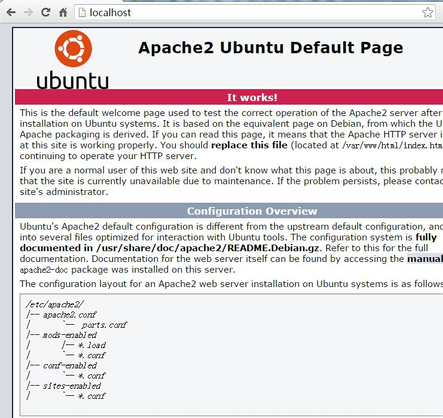

# Ubuntu SVN Apache 配置

> 通过 Apache 来访问 SVN， 也就是我们所熟悉的 HTTP 方式

## Install
- `SVN` 安装，请看 `Ubuntu_svn.md`
- `Apache` 安装

		$ apt-get install apache2

- 依赖服务安装

		$ apt-get install libapache2-svn

## Config

1. 启动 `Apache` 服务

		$ /etc/init.d/apache2 start

2. 访问页面

	- 通过浏览器查看默认网页，默认的端口是 `80`。

		
	
		看到 `It works!` 就说明成功启动了`Apache` 服务
 
	- 如果是 Ubuntu Server 就需要安装 curl 来测试了。

			$ apt-get install curl
			...
			...
			$ curl localhost:80 | grep works
			% Total    % Received % Xferd  Average Speed   Time    Time     Time  Current
	                                 Dload  Upload   Total   Spent    Left  Speed
			100 11321  100 11321    0     0  1240k      0 --:--:-- --:--:-- --:--:-- 1381k
	    	<title>Apache2 Ubuntu Default Page: It works</title>
	          	It works!
		OK! 说明成功了。

3. `Apache` 配置 `SVN` 服务访问站点

		$ cd /etc/apache2/mods-available
		$ cp dav_svn.conf dav_svn.conf.bak # 备份配置文件
		$ vi dav_svn.conf
			
		---- dav_svn.conf 文件最后加上如下内容

		<Location /svn>
			DAV svn
			SVNPath /home/svn/repo
			AuthType Basic
		    AuthName "Ubuntu svn repo"
		    AuthUserFile /home/svn/repo/conf/dav_svn.passwd
			<IfModule mod_authz_svn.c>
			  AuthzSVNAccessFile /home/svn/repo/conf/authz
			</IfModule>
			Require valid-user
		</Location>

4. 重新添加用户加密的密码，之前 SVN 设置的密码是明文的，不可以使用

		$ htpasswd -c /home/svn/repo/conf/dav_svn.passwd admin # 这里的 -c 参数是指创建新文件，第一次设置的时候使用，再设置的时候需要去掉该参数
		New password: 
		Re-type new password: 
		Adding password for user admin

	继续添加其他的用户对应的密码

		$ htpasswd /home/svn/repo/conf/dav_svn.passwd guest  # 注意，这里不需要 -c 参数，因为已经创建过 dav_svn.passwd 文件了
		New password: 
		Re-type new password: 
		Adding password for user guest

5. 重启 `Apache` 服务

		$ /etc/init.d/apache2 restart

6. 修改 `SVN` 仓库文件权限

	不加这个，可能 Windows 不能访问仓库

		$ chmod -R o+rw /home/svn/
		
	
6. 测试 `HTTP` 方式访问 `SVN`
	- 浏览器方式
	
		输入网址 `http://localhost/svn`即可出现登录框，输入用户名，密码即可
	- 命令行`curl`方式

			$ curl http://localhost/svn/ -i --user guest:guest

			HTTP/1.1 200 OK
			Date: Fri, 04 Dec 2015 07:27:40 GMT
			Server: Apache/2.4.12 (Ubuntu)
			Last-Modified: Thu, 03 Dec 2015 10:54:05 GMT
			ETag: W/"3//"
			Accept-Ranges: bytes
			Vary: Accept-Encoding
			Content-Length: 318
			Content-Type: text/html; charset=UTF-8
			
			<html><head><title>svn - Revision 3: /</title></head>
			<body>
			 <h2>svn - Revision 3: /</h2>
			 <ul>
			  <li><a href="android/">android/</a></li>
			  <li><a href="ios/">ios/</a></li>
			 </ul>
			 
<em>Powered by <a href="http://subversion.apache.org/">Apache Subversion</a> version 1.8.13 (r1667537).</em>
			</body></html>

		测试成功了。
		
		
## 相关资料

- 命令行 REST 测试工具 `curl` 使用[点我](http://ju.outofmemory.cn/entry/84875)
- Linux / Unix Command: curl [curl 手冊](http://linux.about.com/od/commands/l/blcmdl1_curl.htm)
		

		
