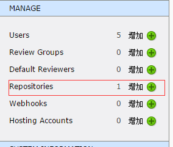

# Ubuntu SVN Apache ReviewBoard 配置 (二)
> ReviewBoard + SVN 配置

参考 [强制 code review：reviewboard+svn 的方案](http://blog.csdn.net/alexdream/article/details/41597045)

## Install & Config

- 安装 reviewboard-svn-hooks

	- 下载解压
		- 浏览器

				https://pypi.python.org/pypi/reviewboard-svn-hooks 并下载，解压

		- curl
	
				# 下载
				$ curl https://pypi.python.org/packages/source/r/reviewboard-svn-hooks/reviewboard-svn-hooks-0.2.1-r20.tar.gz#md5=eecf897045bc496c12efe7082af8c55e > reviewboard-svn-hooks.tar.gz
	
				# 解压
				$ tar -zxf reviewboard-svn-hooks.tar.gz

	
	- 进入目录并安装
	
			$ python setup.py install
			

	- 配置

			$ vi /etc/reviewboard-svn-hooks/conf.ini
			--- conf.ini
				
				[common] # 是否记录 debugging 输出，0 为不输出，其它值为输出  
				debug=0
				
				[reviewboard]  
				# reviewboard 的网址 
				# 如果使用的是目录，如 http://example.com/reviewboard/ 那请务必不要忘记最后的那个“/”  
				url=http://review.xxx.com/
				# reviewboard 的用户名密码，这样才能够通过 http API 访问到 reviewboard 中的 review request 的状态
				username=admin
				password=admin
				
				[rule]
				# 最少需要有几个 ship it
				min_ship_it_count=1
				# 最少需要有几个专家 ship it  
				min_expert_ship_it_count=1
				# 专家的 reviewboard 用户名，使用半角逗号分格
				experts=android1,ios1
				
				# 指定必须 review 的目录，半角逗号分隔，即如果所有改变的文件路径都不含其中的特性字符串，那就不检查 review 状态  
				# 默认为空，即表示强制 review 所有提交请求  
				# 例子： review_path = src, "cc/d,oc"  
				# 表示只有当改变的文件的路径中包含 src 或 cc/d,oc 目录时才要求 review，  
				# 关键路径中不能带有半角逗号  
				review_path=
				#review_path=src, "cc/dd"

				# 如果变更的文件全部在 ignore_path 里，则不会触发检测。  
				ignore_path = 

			--- save & close

	- 生成 rb-svn-hooks-used-rid.db 文件
	
			# init_used_rid_db $CONFDIR/reviewboard-svn-hooks/rb-svn-hooks-used-rid.db $MAX_REQ_ID
			# 其中 $CONFDIR 表示 reviewboard-svn-hooks 的安装路径
			# 其中 $MAX_REQ_ID 表示当前 ReviewBoard 中最大的 Request id
			# 假设当前最大的 Request id 为 1, $CONFDIR 为 /etc/ 则完整命令为
			$ init_used_rid_db /etc/reviewboard-svn-hooks/rb-svn-hooks-used-rid.db 1

	- 修改 rb-svn-hooks-used-rid.db 权限

			$ chown -R www-data rb-svn-hooks-used-rid.db
			
			
- SVN hooks pre-commient 配置
			

		$ cd /home/svn/repo/hooks
		$ touch pre-commit
		$ vi pre-commit
		--- pre-commit
			# 清除所有内容，并粘贴如下内容

			REPOS="$1"  
			TXN="$2"  

			# 强制提交代码 填写不少于5个字的注释
			SVNLOOK=/usr/bin/svnlook
			LOGMSG=`$SVNLOOK log -t "$TXN" "$REPOS" | grep "[a-zA-Z0-9]" | wc -c`

			if [ "$LOGMSG" -lt 5 ]; then
			    echo -e "\nOops! you must input more than 5 chars as comment!." 1>&2
			    exit 1
			fi
			
			# 向 ReviewBoard 校验对应的 request id 是否正确
			# 若review通过了，则需要 comment 要在 log message 里写上符合正则表达式 r'review:([0-9]+)' 的信息
			# 比如 #review:199 表示这次提交的变更对应 ID 为 199 的 review request，
			# 当 strict_review 这个 hook 检测到 review request 199 符合预设的条件后，就会放行让变更进入仓库。
			strict_review $REPOS $TXN

			exit $?  
	
		--- 保存并退出

- 在 ReviewBoard 中创建一个代码仓库

	- 访问 `http://review.xxx.com/admin/`， 使用 `admin` 用户登录。

	- 选择`Repositories`

		
	- 填写基本内容并保存。

	- Oops! 保存出错，提示 `subvertpy` 没有安装？

			$ apt-get install python-subvertpy

		再次保存即可

- 在本地仓库配置

	- Checkout 代码到本地

			$ svn co http://localhost/svn repo

	- 进入本地仓库

			$ cd repo

	- 绑定 ReviewBoard 中创建的 repo 仓库

			$ rbt setup-repo
			Enter the Review Board server URL: http://review.xxx.com
			Use the Subversion repository "repo" (http://localhost/svn)? [Yes/No]: yes
			Create "/home/lwz/repo/.reviewboardrc" with the following?

			REVIEWBOARD_URL = "http://review.xxx.com"
			REPOSITORY = "repo"
			
			 [Yes/No]: yes
			Config written to /home/lwz/repo/.reviewboardrc

	- OK, 一切顺利

		
		
- 安装 Subversion tools

	参考 [Subversion 服务器 mailer 指南](http://www.cnitblog.com/tilan/articles/21835.html)

	- 安装

			$ apt-get install subversion-tools

	- 配置 SVN 提交自动发送邮件
			
			$ cp /usr/share/subversion/hook-scripts/mailer/mailer.py /home/svn/repo/conf/mailer.py
			$ cp /usr/share/subversion/hook-scripts/mailer/mailer.conf.example /home/svn/repo/conf/mailer.conf

	- 配置 mailer.conf

			$ vi /home/svn/repo/conf/mailer.conf
			--- mailer.conf

				// TODO， 现在暂时不配置邮件

			--- save & close

## 其他参考资料

- [post-commit hook](http://my.oschina.net/donhui/blog/321130)
- [【Programming Style】既然 Code Review 這麼重要，那應該要選 Pre-Commit 還是 Post-Commit 呢？](http://buzzorange.com/techorange/2013/06/25/pre-commit-or-post-commit/)