# Ubuntu SVN Apache ReviewBoard 配置 (三)
> ReviewBoard 设置与使用

## 设置

参考资料 [https://www.reviewboard.org/docs/manual/2.5/admin/admin-ui/dashboard/](https://www.reviewboard.org/docs/manual/2.5/admin/admin-ui/dashboard/)

1. 使用浏览器进入你自己搭建的 ReviewBoard 网站并使用 `admin` 用户登录
2. 选择 `Admin` 项

	

	即可进入 Admin 面板

	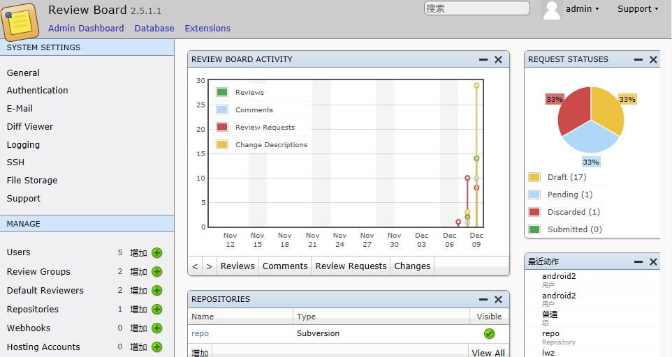

3. 添加仓库 Repositories
	- 新增 repository
	- `Name` 填写仓库的名字
	- `Repository type` 选择 `Subversion`
	- `Path` 填写 SVN Http 的访问地址即可，例如 `http://localhost/svn` 
	- `Mirror path` *可以不填写*
	- `Username` SVN 的用户名，建议创建一个 Guest 用户，用来读取 SVN 的信息
	- `password` SVN `Username` 对应的密码

4. 添加用户
	- 新增 Users
	- 填写 `用户名`，`密码` 等信息
	- 点击保存
	- 自动进入`修改 用户`界面，填写个人信息
	- 权限
		- 勾选 `有效` `职员` 项
	- 组
		- 可以新增一个组，设置组用户相应的权限（
	- 用户权限
		- 选择该用户享有的权限
	- 点击保存

5. 添加 Review Groups
	- 增加 review group
	- 填写`名称`，`显示名称`
	- 权限配置（Access Control）
		- 选择用户进入该群组
	- 点击保存按钮

6. 添加默认 Reviewer
	- 增加 default reviewer
	- 填写 `Name`
	- `File regular expression` 填写文件路径的正则表达式
	- Default groups
		- 选择 该 Reviewer 的默认组
	- Default users
		- 选择该 Reviewer 的默认用户
	- Repositories
		- 选择该 Reviewer 的仓库

## 使用

### 发布 Review 
- 手动上传 `diff`
	- windows
		- 本地检出 svn repo 仓库
		- 修改文件，保存并退出
		- 点击右键，选中 `create patch`
			
			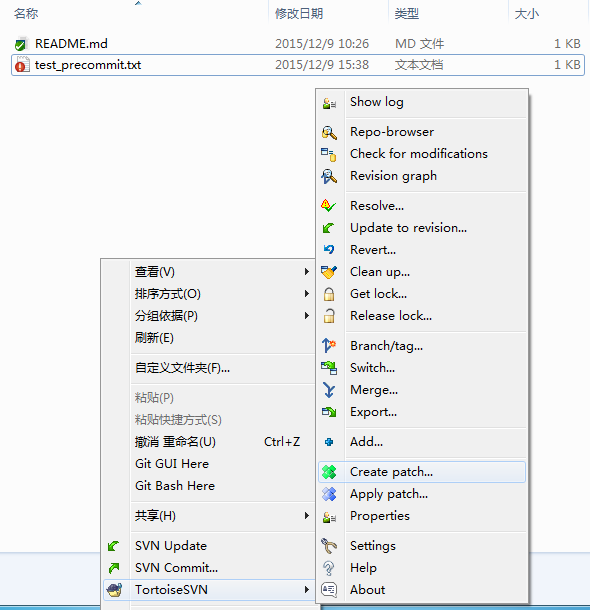
		- 生成一个 `patch` 文件
	
			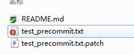
	
		- 进入 ReviewBoard 网页，并使用普通用户登录
		- 点击 `New Review Request`
	
			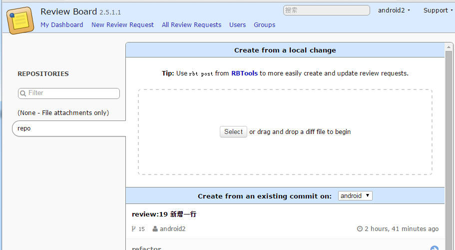
	
		- 将本地的 `patch` 文件上传
		- 输入该 `diff` 的路径，后点击`OK`
	
			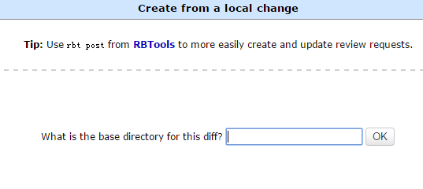
		- 发布 `review`
		
			- 其中 `Summary`, `Description`,`Reviewers` 为必填项
			- 最后，请点击 `Publish` 按钮
	
			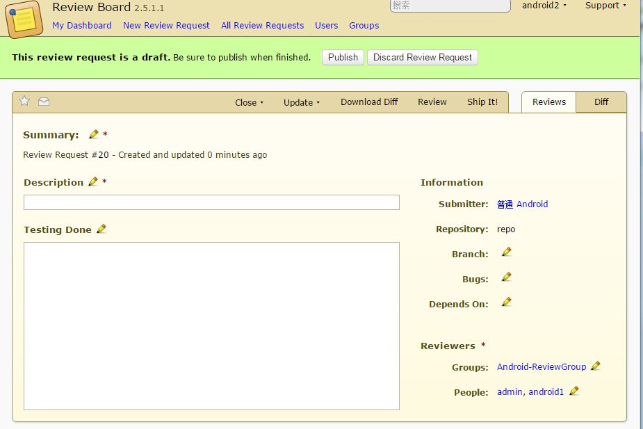
		- 在 `My Dashboad` 中查看刚才提交的 `Review`
		
			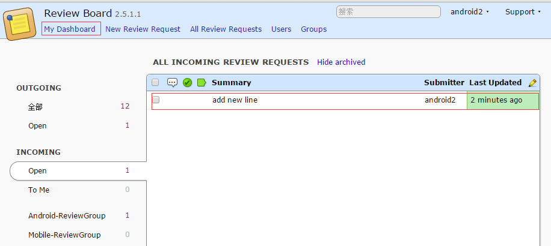

- 命令行上传 `diff`

	命令行主要是通过 ReviewBoard Tools 中的 `rbt post` 命令来将 `diff` 上传 
	- 本地检出 svn repo 仓库
		
			$ svn co http://localhost/svn repo

	- 修改文件,保存修改并退出。假设文件为 `repo/android/test_precommit.txt`
	- 查看修改状态
		
			$ svn status # 查看 SVN 状态
			$ svn diff   # 查看修改的内容

	- 提交到 ReviewBoard。 `rbt post` 用法可以使用 `rbt post --help` 查看

			$ rbt post --username xxx --password xxx  --summary 'some summary' --description 'some desc'
			# 其中 xxx 替换为 ReviewBoard 中的用户名和密码
			Review request #21 posted.  # 说明已经上传好了，Review Id 为 21。可以登录网页查看
			
		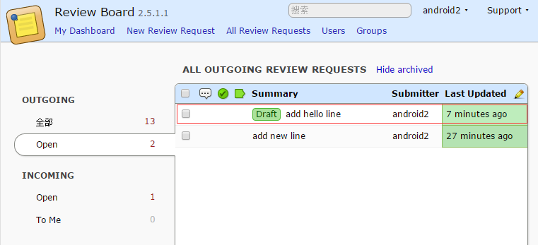

		在刚才的命令行后面加上 ` -p` 则表示直接发布。
		
		具体的用法请看 `rbt post --help`，或者访问官方网站 [rbt commands post](https://www.reviewboard.org/docs/rbtools/0.6/rbt/commands/post/)

		要将草稿 `Draft` Review 发布，有两种方式

		1. 登录网页，点击 `Publish` 按钮（操作和*手动上传*中的 *发布 'review'* 一致）
		2. 直接使用命令行发布

				$ rbt post -username xxx --password xxx -u -r 21 -p
				# 其中 -u 为更新；-r 21 为 Review Id 为 21； -p 为发布
				Review request #21 posted. # 说明更新成功

	由谁来审核？
	记得刚才 `发布 Review` 中选择了 `Reviews` 这一项么？
	
	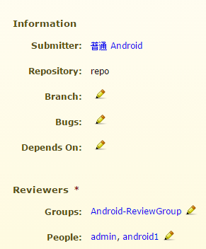
	
	`People` 就是审核的人。

### 审核 Review 

- 使用浏览器进入你自己搭建的 ReviewBoard 网站并使用审核账号权限的用户登录，这里使用 `android1`登录（这货可是专家， 记得 `reviewboard-svn-hooks`中的配置么？）

- 查看需要 Review 的 Request

	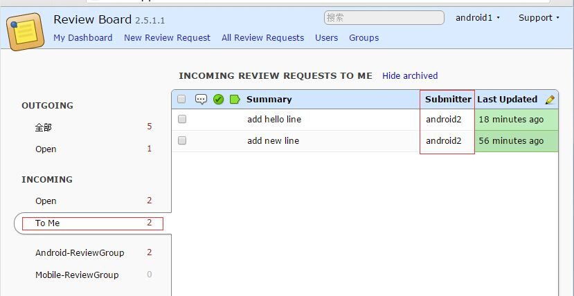

	可以看到刚才的 `android2` 的 Review 请求

- 点击 Review Request 查看详情

	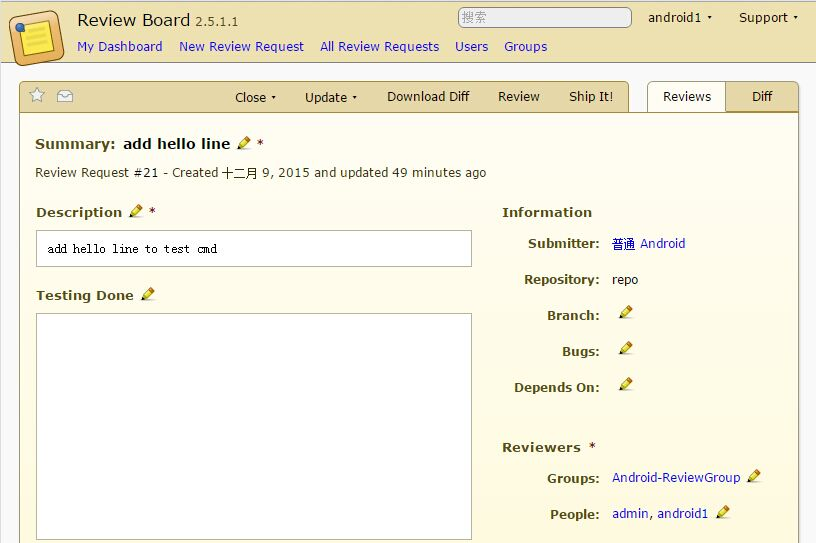

- 点击 `Diff`选项, 查看文件修改处

	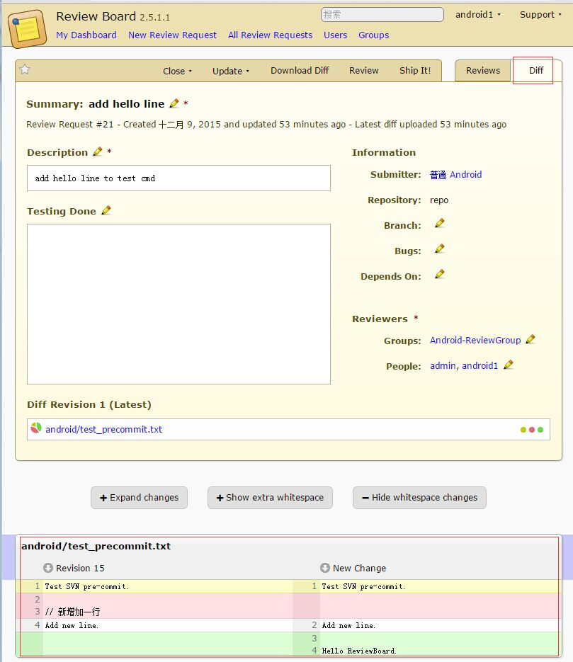
	
- 双击 新增加的代码处 增加评论

	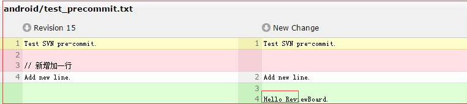
	

- 添加评论并保存，在左下角，就可以看到一个标记了

	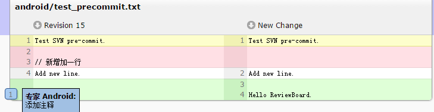

- 等你完成后，别忘了点击 `Publish` 按钮哦！

- 点击 `Reviews` 选项出，查看有什么变化

	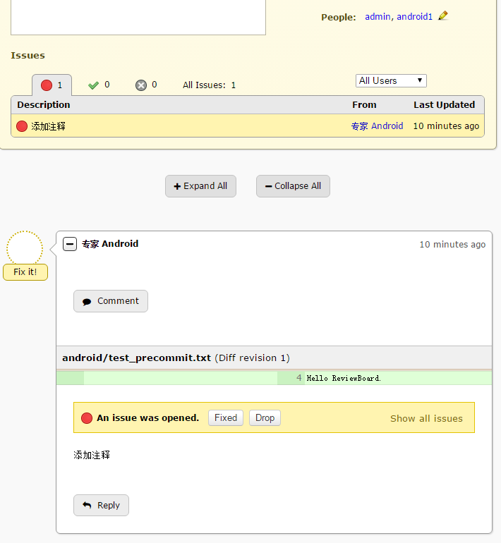

### 查看 Reviewer 的反馈

- 切换到 `android2` 账号（这货是被审核的可怜的孩子）
- 查看 `My Dashboard`

	

	看到变化了么？那个小标记就是说明有一条回复了

- 查看详情

	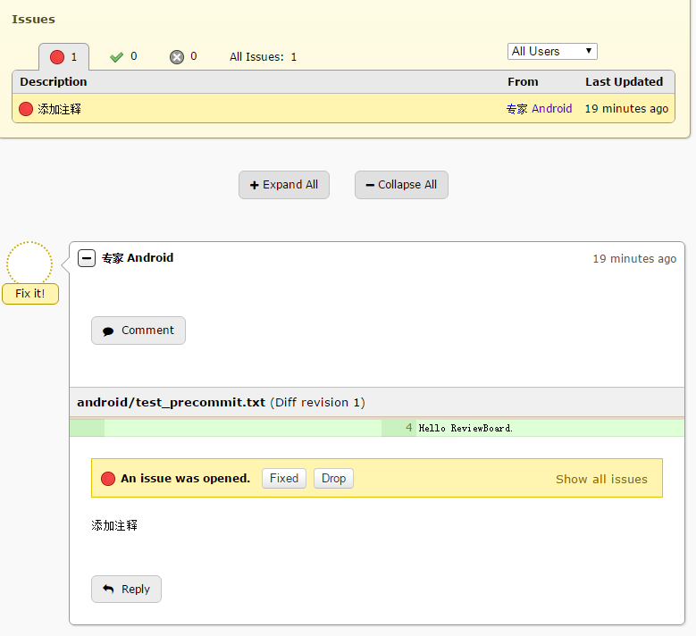

- 现在，你看到了“专家”的评论，并叫你 `Fix it`，你可以

	- 看到 `Reply` 按钮了么？你可以告诉他你不执行“专家的忠告”的原因，没准“专家”被你说服了，就放过你了。
	- 你觉得“专家的忠告”很有道理，觉得应该安装专家说的做，那么，我们继续

- 选择 `Update`>`Update Diff`选项，

	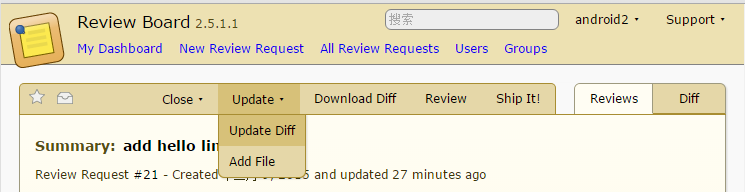

	没错，这个就是要你上传你修改的 `patch`, 怎么生成`patch`？请看 `发布 Review`中的教程

- 上传完成 新的 `diff` 后，并且 `Publish`

	可以看到 `Reviews`选项已经改变了

	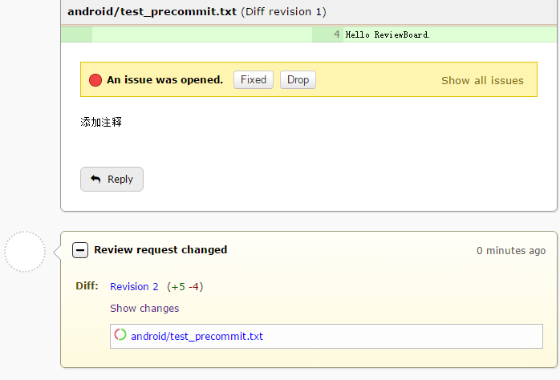

	我们再来看看 `Diff` 选项

	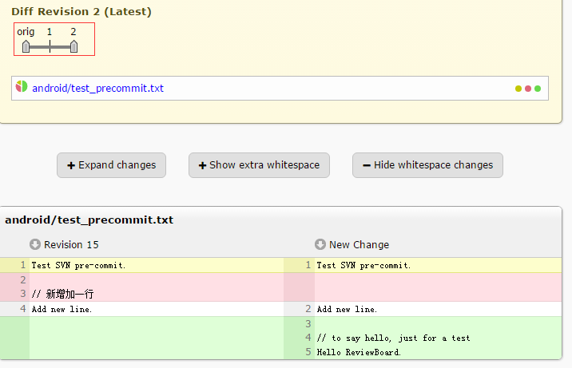

	看到了`orig` 了么？ 这个可以拖动的，查看每一次修改对应的内容，试一试吧。

### Reviewer 处理反馈

-  进入到对应的 Review Request 查看 `Reviews` 选项

	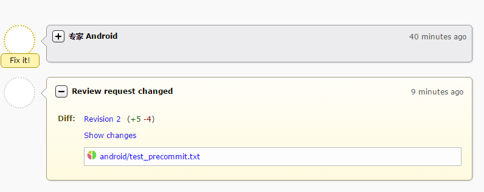

	点击 `show changes` 可以看到改变的地方，如果你觉得改的 OK, 那就 点击 `Fixed` 按钮。

	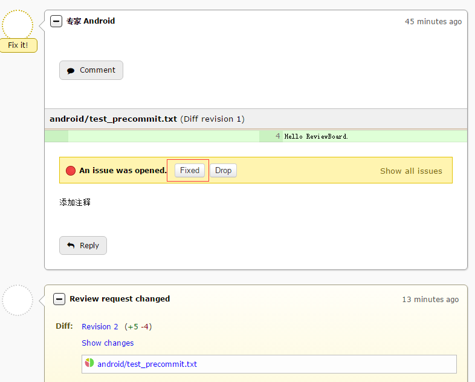
	
	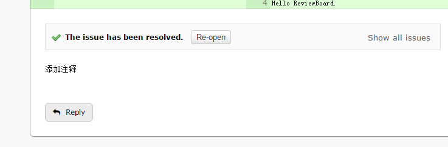

- Ship it ?

	如果你觉得 OK, 那么就点击 `Ship it` 选项允许可怜的 `android2`通过吧！	否则就重来一次吧~。

	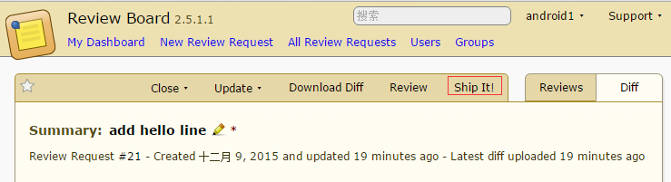
	
	跳转到 `My Dashboard` 选项

	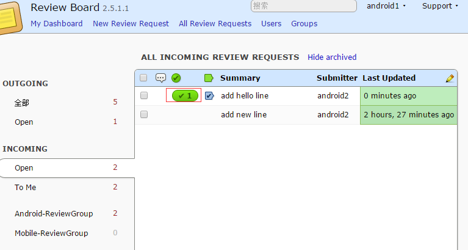

	看到那个标记了么，这就说明通过了，`android2` 看到这个肯定会欣喜若狂的。

### 提交到 SVN

心累的 `android2`经过上面的折腾，终于可以提交代码到 SVN 了。（“早知道就遵循开发规范，好好写代码了，一次性通过多好”,`android2`弱弱的说）

- 关闭 Review Request

	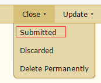

	记得关闭这个 Review Request 哦.

- 提交修改到 SVN

		$ svn commit
		Transmitting file data .svn: E165001: Commit failed (details follow):
		svn: E165001: Commit blocked by pre-commit hook (exit code 1) with output:
		-e 
		Oops! you must input more than 5 chars as comment!.

	是的，不填写至少 5个单词的 comment 是无法提交到 SVN 的，还记得 `SVN hooks pre-commient 配置` 么？

		$ svn commit -m 'add hello line'
		Transmitting file data .svn: E165001: Commit failed (details follow):
		svn: E165001: Commit blocked by pre-commit hook (exit code 1) with output:
		No review id.

	Oops! 没有通过 Review 的代码是无法提交的。正确的提交 Comment 如下

		$ svn commit -m 'review:21 add hello line'
		Transmitting file data .
		Committed revision 16.

		# 其中 review:21 表示提交的是 review id 为 21的记录
		# 正确的Comment 为 "review:REQUEST_ID xxx"

	是的，成功了。可怜的 `android2`，终于提交完成了。（“虽然身心备受折磨，但是版本库的代码更加的规范了。多遵循开发规范，代码就越来越好了，真是太好了”，`android2`如是说)
